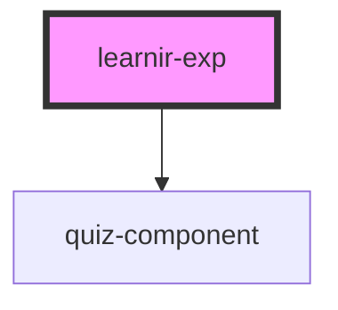

# learnir-exp

<!-- Auto Generated Below -->

## Properties

| Property    | Attribute   | Description | Type     | Default     |
| ----------- | ----------- | ----------- | -------- | ----------- |
| `component` | `component` |             | `string` | `undefined` |
| `consumer`  | `consumer`  |             | `string` | `undefined` |

## Dependencies

### Depends on

- [quiz-component](../quiz-component)

### Graph

----------------------------------------------

*Built with [StencilJS](https://stenciljs.com/)*
