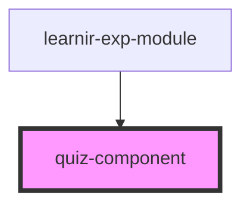

# quiz-component

<!-- Auto Generated Below -->

## Properties

| Property    | Attribute   | Description | Type       | Default     |
| ----------- | ----------- | ----------- | ---------- | ----------- |
| `consumer`  | `consumer`  |             | `string`   | `undefined` |
| `data`      | --          |             | `object`   | `undefined` |
| `options`   | `options`   |             | `any`      | `undefined` |
| `request`   | --          |             | `Function` | `undefined` |
| `submit`    | --          |             | `Function` | `undefined` |
| `submitted` | `submitted` |             | `boolean`  | `undefined` |

## Dependencies

### Used by

 - [learnir-exp-module](../learnir-exp-module)

### Graph

----------------------------------------------

*Built with [StencilJS](https://stenciljs.com/)*
